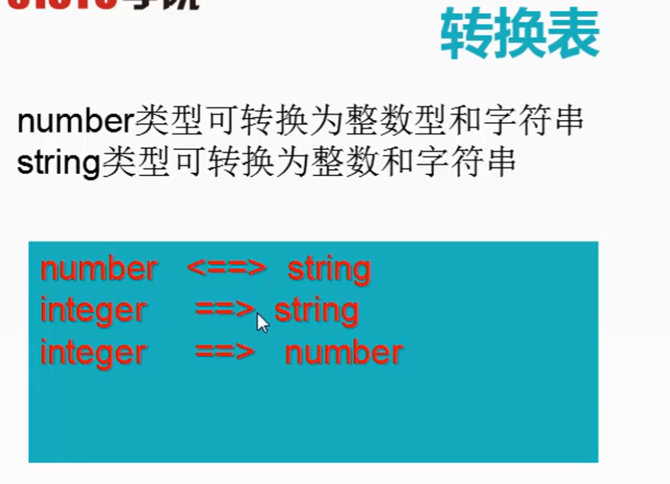

# lua c/c++ 混编个人笔记
## 1 lualib 编译静态库
## 2 luadll 编译动态库
1. 编译LuaDll即可在项目设置目录里生成响应动态库
2. 因为first设置了References的缘故,直接编译first也可以


# 教程2
[参考教程](https://edu.51cto.com/center/course/lesson/index?id=221460)
# 1 lua编译
## 1.1 编译准备，修改源码
* lua提供了多线程访问的互斥锁，但是只定义了宏，并没有实现
* 编译的时候需要根据平台，修改宏。windows平台，可以使用临界区来实现。
	* 初始化临界区：InitializeCriticalSection
    	* 在lstate.h 中添加临界区结构体
		* 在lstate,c 中初始化
	* 进入临界区： EnterCriticalSection
    	* 在llimits.h 中253行修改
	* 离开临界区： LeaveCriticalSection
    	* 同上
	* 然后close 在lstate.c 中

----
# Lua 函数分类
1. 改变堆栈类, 不改堆栈类
2. 带L关键字(宏),不带L关键字
----
# lua执行方式
## 1 从字符串执行
* luaL_dostring(L,代码字符串)
    * 失败才会改变堆栈,会执行(底层是luaL_loadstring() 和lua_pcall)
* luaL_loadstring(L,代码字符串)
    * 不管是否失败都会改变堆栈, 代码会被封装成一个匿名函数放入栈顶,不会执行
    * 补充lua_pcall(L, 参数个数, 返回值个数, 错误处理函数)
        * 自动 弹出栈顶的函数

 

## 2 读取文件执行  
    同字符串方法，不过是由字符串换成了路径。

* luaL_dofile()
* luaL_loadfile()
----
# 全局变量交互

## C注册全局变量  
lua_setglobal(L, 全局变量名)  
把栈顶的值设置为全局变量，并且弹出栈顶的值  
    * lua中有个全局表 _G 存储了全局变量，如果C注册全局变量，也会在这个表中查找到。

## C获取lua全局变量
#### lua_getglobal(L,全局变量名)  
获取lua代码中的全局变量，放入堆栈  
返回值： 全局变量的类型  返回值对应的数字的含义在lua.h 中，比如 3 是number  
若全局变量不存在，返回 <= 0

#### lua_setglobal(L,全局变量名)
把栈顶的值设置为全局变量，并且弹出栈顶的值

----
# 基本数据类型交互
lua_tonumber,lua_tostring这种不会改变堆栈


小数能取字符串，整数不能  
字符串能取整数和小数
小数能取整数，整数不能取小数


----
# luaL_tolstring

还有一个lua_tolstring() 但是这个不会触发元表的"_tostring"方法

----
# C++调用Lua函数及调用注意事项 lua_pcall
lua_pcall的参数影响堆栈,以及是否正确调用,需要注意!


----

## C++ 调用Lua函数-变长参数模板和返回值
* 变长参数模板  
  这里只写了c++11 递归方法,未考虑c++ 17 折叠表达式 和c++ 20新特性
```cpp
template<typename..._Args>
Function(_Args&...args)
{
}
```


已知栈顶-1，要获取末尾的N个参数则：
序号围殴-1-（N+1)

----
# TODO
[lua嵌入c++教程](https://www.youtube.com/watch?v=xrLQ0OXfjaI&list=PLLwK93hM93Z3nhfJyRRWGRXHaXgNX0Itk)
